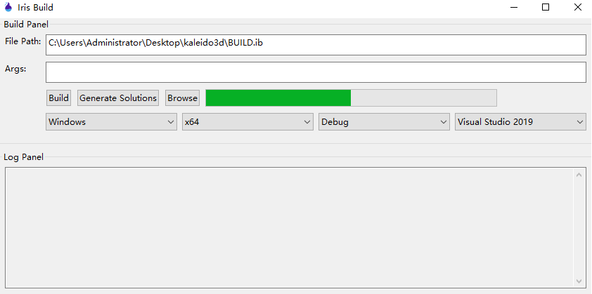

Introduction
===

**IrisBuild** is a meta build system for cross-platform projects. Currently it was used in project [**Kaleido3D**][1]. We can also use it to generate Visual Studio solutions for Windows, Android and iOS project with full featured code-complete functionality.

---

## Features

- [ ] **GN** build syntax support (Google's `Generate Ninja`)
    - [x] Built-in variables: `target_os`,`target_arch`,`target_config`
    - [x] Built-in function for targets: 
        - [x] `shared_library`, `static_library`, `executable` (include apple app bundle, game **console** targets)
        - [ ] `android_apk`
            - [ ] maven package downloader
                - [x] pom parsing
                - [ ] package dependency resolving
            - [ ] AndroidManifest merging
            - [x] apk signing
            - [x] jni compilation and packaging
        - [ ] `ohos_hap`, for **HUAWEI**'s **HarmonyOS**
- [x] Built-in functions:
    - [x] `zip` & `unzip`
    - [x] `download` & `download_and_extract`
- [x] Supported source file types:
    - [x] **asm**, **c**, **cpp**, **objc**, **objcc**, **ispc**, **swift**, **pssl**
    - [x] java (android)
    - [ ] rust
        - [ ] `cargo.toml` parsing to get targets (`bin`, `lib`, etc.)
        - [ ] Cross architect compiling
- [ ] ***Mobile*** device deployment support (use [`mixdevice`][4])
    - [ ] App install/uninstall
    - [ ] App debug support
    - [x] **Apple** Developer Service support
    - [ ] Profiling support (iOS instruments)
    - [ ] Windows Apple USB Driver (with QuickTime Video Streaming support)
- [ ] Flawless [Incredibuild][5] replacement
    - [x] virtual file system driver for `PE` loader
    - [x] hook-based file IO
    - [ ] hook-based virtual process environment
        - [ ] registry
        - [ ] environment variables
        - [ ] managed `stdout`/`stderr`/`stdin` pipe
    - [ ] GPGPU API support (DirectX/OpenCL)
        - [ ] command stream based
- [ ] Incremental compiled object link, check timestamp and source files (list) change.
---

## Supported Toolchains:

* Visual Studio 2017+
* Xcode 8+/[iOS Build Env(Windows)][3]
* Android NDK 14+ & Android SDK & Gradle
* Huawei HarmonyOS
* Playstation 4 & **5** (Require developer status confirmation)
* AMD HIP 6.1+
* NVIDIA CUDA v12+ & Optix 7+
* Intel ISPC

# Toolchain scan order and setup

* Windows
    * Visual Studio **MSVC**
    * **`LLVM Toolchain`** (Under MSVC folder, install through **VSInstaller**)
        * clang-cl
        * clang: Cross compile `ObjC`
    * `Swift on Windows`
        * check default installation directory
        * iOS build support
    * Intel SMPD Compiler (ISPC)
        * Environment Variable **`PATH`**
        * Environment Variable **`ISPC_EXECUTABLE`**
* Android
    * Check environment variables first 
        * JAVA_HOME
        * ANDROID_SDK_HOME
        * ANDROID_NDK_HOME
    * If variables above not found, check following locations consecutively
        * Windows Registry
            * `Java_Home` (`LOCAL_MACHINE\SOFTWARE\JavaSoft\Java Development Kit`)
        * Android Studio's **JRE**
        * Android Studio's SDK folder (`$USER/AppData/Local/Android/SDK`) and NDK Bundles(Side by Side)
* Apple
    * Xcode
        * By execute **`xcode-select -p`**
        * Clang and Swift toolchain locations are set by Xcode installation directory
    * Intel SMPD Compiler (ISPC)
        * Environment Variable **`PATH`**
        * Environment Variable **`ISPC_EXECUTABLE`**
* Sony PlayStation
    * Search PS toolchain environment variables
* Nintendo Switch
* Harmony OS

# yCode

[yCode](src/ycode/ReadMe.md) ReadMe

# TODOs

- [x] Replace origin `zlib` with simd acceleration version
- [ ] Jobs limit on CPU and Memory Usage
- [ ] Nintendo Switch support
- [ ] Harmony OS support
- [ ] Rust toolchain and cross compilation support
- [ ] Async call support
- [x] CUDA Toolkit support
- [x] AMD HIP support
- [ ] C++ module support

> The details are documented in the [Wiki][2].

Read the quick start guide [here](doc/grammar.md).

# Third Party

- 7zip (Windows, LGPL) for **7z** decompression
- Sevenz-Rust (Linux*, Mac/IOS/Android, Apache 2) for **7z** decompression
    - lzma-rs (MIT)
- Apache Thrift
- detours (Microsoft)
- tinyxml
- minizip
- zlib
- mixdevice
- libui (MIT)

[1]:https://github.com/kaleido3d/kaleido3d
[2]:https://github.com/kaleido3d/IrisBuild/wiki
[3]:https://www.pmbaty.com/iosbuildenv/
[4]:https://github.com/DsoTsin/mixdevice2
[5]:https://www.incredibuild.com
