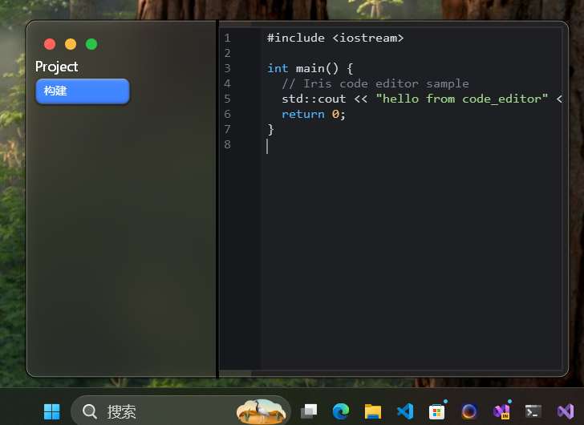

Introduction
===

**Iris Code** is a Codex-like code editor (AI-assisted) focusing on cross-platform development, debugging and profiling.

> UI framework based on Skia

- SwiftUI compatible interface
- SkiaCpp backend

